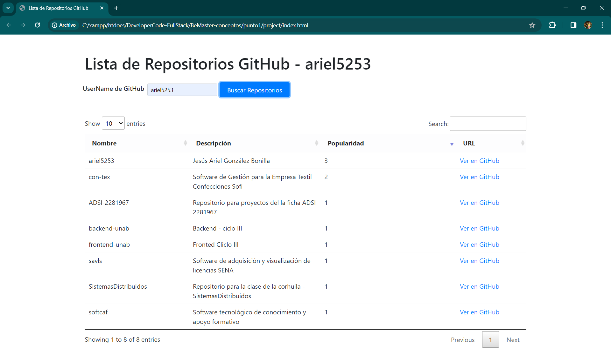

Para probar la aplicación, sigue estos sencillos pasos:

**Clona el Repositorio:**
```bash
git clone https://github.com/DeveloperCode-FullStack/BeMaster-conceptos.git

# Accede al Directorio del Proyecto:
cd punto1/project

# Instalación de Dependencias
## Ejecuta el siguiente comando para instalar las dependencias necesarias:
npm init -y
npm install express axios

# Instala las Dependencias con npm:
npm install

# Ejecuta el Proyecto Node:
npm start

# Abre el Archivo index.html:
Abrir con doble click

# Prueba la Aplicación:
¡Ahora puedes navegar por la aplicación y probar todas sus funcionalidades! Utiliza el usuario de GitHub "ariel5253", te debe retonar lo siguiente: 

```

## Vista del usuario


¡Listo! Si hay alguna pregunta, estaré atento.